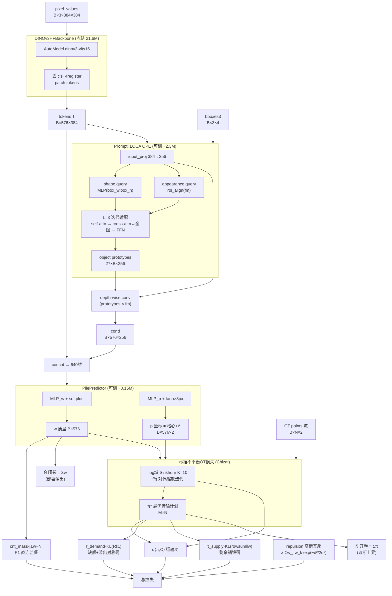
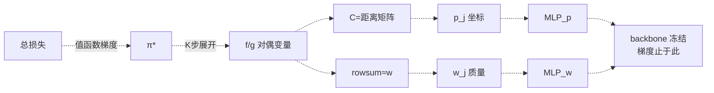
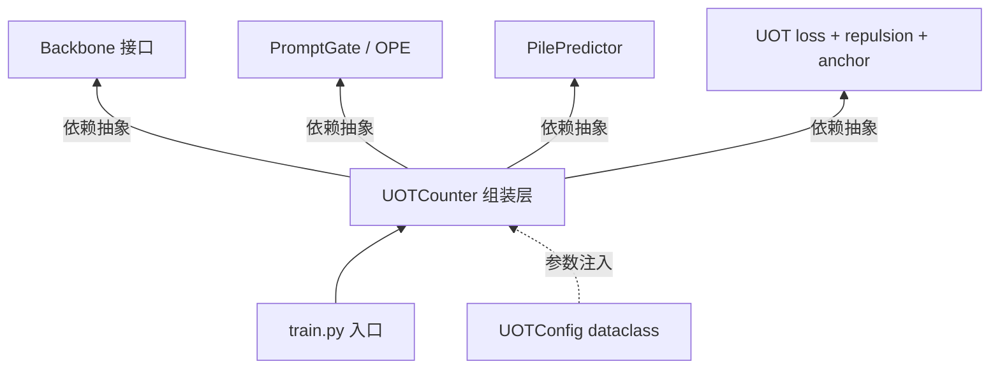

# cac_uot 结构图

## 总体数据流

```mermaid
flowchart TB
    IMG[pixel_values<br/>B×3×384×384] --> BB

    subgraph BB["DINOv3HFBackbone (冻结 21.6M)"]
        B1["AutoModel dinov3-vits16"] --> B2["去 cls+4register<br/>patch tokens"]
    end

    B2 --> T["tokens T<br/>B×576×384"]

    T --> PR

    BOX[bboxes3<br/>B×3×4] --> PR

    subgraph PR["Prompt: LOCA OPE (可训 ~2.3M)"]
        P1["input_proj 384→256"] --> P2["shape query<br/>MLP(box_w,box_h)"]
        P1 --> P3["appearance query<br/>roi_align(fm)"]
        P2 --> P4["L=3 迭代适配<br/>self-attn → cross-attn↔全图 → FFN"]
        P3 --> P4
        P4 --> P5["object prototypes<br/>27×B×256"]
    end

    P5 --> P6["depth-wise conv<br/>(prototypes × fm)"]
    P1 --> P6
    P6 --> COND["cond<br/>B×576×256"]

    T --> CAT2["concat → 640维"]
    COND --> CAT2

    CAT2 --> HD

    subgraph HD["PilePredictor (可训 ~0.15M)"]
        W1["MLP_w + softplus"] --> W2["w 质量 B×576"]
        P8["MLP_p + tanh×8px"] --> P9["p 坐标 = 格心+Δ<br/>B×576×2"]
    end

    W2 --> UOT
    P9 --> UOT
    PTS[GT points 坑<br/>B×N×2] --> UOT

    subgraph UOT["标准不平衡OT损失 (Chizat)"]
        S1["log域 Sinkhorn K=10<br/>f/g 对偶缩放迭代"]
        S1 --> S2["π* 最优传输计划<br/>M×N"]
    end

    S2 --> L1["α⟨π,C⟩ 运输功"]
    S2 --> L2["τ_demand·KL(R‖1)<br/>缺额+溢出对称罚"]
    S2 --> L3["τ_supply·KL(rowsum‖w)<br/>剩余销毁罚"]
    W2 --> CM["cnt_mass·|Σw−N|<br/>P1 直连监督"]
    S1 --> L1

    L1 --> TOT[总损失]
    L2 --> TOT
    L3 --> TOT
    CM --> TOT
    REP["repulsion 高斯互斥<br/>λ·Σw_j w_k exp(−d²/2σ²)"] --> TOT

    S2 --> RD1["N̂ 开卷 = Σπ<br/>(诊断上界)"]
    W2 --> RD2["N̂ 闭卷 = Σw<br/>(部署读出)"]
```

## 梯度回传路径

```mermaid
flowchart LR
    LOSS[总损失] -.值函数梯度.-> PI[π*]
    PI -.K步展开.-> FGM[f/g 对偶变量]
    FGM -.-> C[C=距离矩阵] -.-> P9x[p_j 坐标] -.-> MLP_P[MLP_p] -.-> BBX
    FGM -.-> ROWSUM[rowsum≈w] -.-> WX[w_j 质量] -.-> MLP_W[MLP_w] -.-> BBX
    BBX[backbone 冻结<br/>梯度止于此]
```

## 模块依赖（依赖倒置）

```mermaid
flowchart BT
    TR[train.py 入口] --> CT[UOTCounter 组装层]
    CT -->|依赖抽象| BB[Backbone 接口]
    CT -->|依赖抽象| PG[PromptGate / OPE]
    CT -->|依赖抽象| PH[PilePredictor]
    CT -->|依赖抽象| LS[UOT loss + repulsion + anchor]
    CFG[UOTConfig dataclass] -.参数注入.-> CT
```

> 换 prompt：`cfg.prompt_type="cosine"|"ope"`；换求解器：`cfg.solver`。互不耦合。
